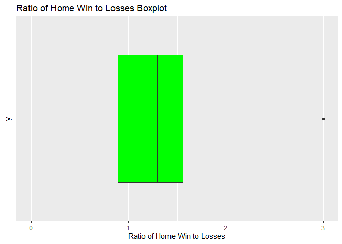
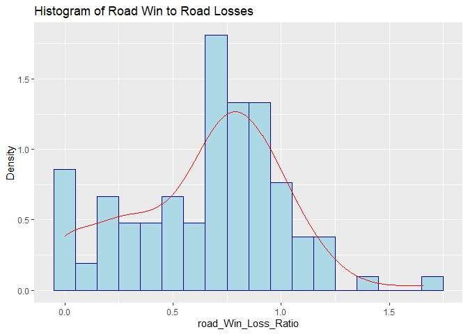

ST 558 Project 1
================
Marcus Lee
6/13/2021

-   [JSON Data](#json-data)
-   [Packages used for reading JSON data in
    R](#packages-used-for-reading-json-data-in-r)
-   [Contact the NHL Records API](#contact-the-nhl-records-api)
-   [Contact the NHL Stats API](#contact-the-nhl-stats-api)
    -   [Wrapper function](#wrapper-function)
-   [Exploratory Data Analysis](#exploratory-data-analysis)
    -   [Contigency Tables/ Numerical
        Summaries](#contigency-tables-numerical-summaries)
    -   [Graphical Summaries](#graphical-summaries)

``` r
library(ggplot2)
library(tidyverse)
library(jsonlite)
library(knitr)
library(httr)
```

# JSON Data

JSON, also known as [*Java Script Object
Notation*](https://www.json.org/json-en.html) is a text based format for
storing and transporting data. JSON is used widely across the internet
and databases because of its text based format for storing data(Example:
Getting data using API). In addition, JSON can represent 2D data,
[hierarchical
data](https://en.wikipedia.org/wiki/Hierarchical_database_model), and
use key-value pairs.

Since JSON is a text based format, we need to load in R packages that
can handle JSON data.

# Packages used for reading JSON data in R

Here are R packages that can be used to work with JSON data:

-   `rjson`
-   `RJSONIO`
-   `jsonlite`

For this project, `rjson` and `jsonlite` is used.

Here are a couple resources for understanding the functionality of
`rjson` and `jsonlite`:

1.  <https://cran.r-project.org/web/packages/rjson/rjson.pdf>

2.  <https://cran.r-project.org/web/packages/jsonlite/jsonlite.pdf>

# Contact the NHL Records API

To access the [NHL Records
API](https://gitlab.com/dword4/nhlapi/-/blob/master/records-api.md), we
need to construct a URL with the name of the table and attributes we
want to pull from it.

In addition, I wrote 5 more functions that take different endpoints. In
terms of preserving space in the ReadME.md, you can find the 5 functions
in the README.Rmd.

``` r
base_url = "https://records.nhl.com/site/api"
```

``` r
get_franchise = function(){
  full_url = paste0(base_url, "/franchise")
  franchise_text = content(GET(url=full_url), "text")
  franchise_json = fromJSON(franchise_text, flatten = T)
  return(franchise_json$data)
}
```

Here is an use case of the `get_franchise` function working.

``` r
#This id represent the New Jersey Devils
id=23 
franchise = get_franchise()
franchise_team_total = get_franchise_team_totals()
franchise_season_records = get_franchise_season_records(id)
franchise_goalie_records = get_franchise_skater_records(id)
franchise_skater_records = get_franchise_skater_records(id)
franchise_detail = get_franchise_detail(id)
```

``` r
kable(franchise)
```

|  id | firstSeasonId | fullName              | lastSeasonId | mostRecentTeamId | teamAbbrev | teamCommonName | teamPlaceName |
|----:|--------------:|:----------------------|-------------:|-----------------:|:-----------|:---------------|:--------------|
|   1 |      19171918 | Montréal Canadiens    |           NA |                8 | MTL        | Canadiens      | Montréal      |
|   2 |      19171918 | Montreal Wanderers    |     19171918 |               41 | MWN        | Wanderers      | Montreal      |
|   3 |      19171918 | St. Louis Eagles      |     19341935 |               45 | SLE        | Eagles         | St. Louis     |
|   4 |      19191920 | Hamilton Tigers       |     19241925 |               37 | HAM        | Tigers         | Hamilton      |
|   5 |      19171918 | Toronto Maple Leafs   |           NA |               10 | TOR        | Maple Leafs    | Toronto       |
|   6 |      19241925 | Boston Bruins         |           NA |                6 | BOS        | Bruins         | Boston        |
|   7 |      19241925 | Montreal Maroons      |     19371938 |               43 | MMR        | Maroons        | Montreal      |
|   8 |      19251926 | Brooklyn Americans    |     19411942 |               51 | BRK        | Americans      | Brooklyn      |
|   9 |      19251926 | Philadelphia Quakers  |     19301931 |               39 | QUA        | Quakers        | Philadelphia  |
|  10 |      19261927 | New York Rangers      |           NA |                3 | NYR        | Rangers        | New York      |
|  11 |      19261927 | Chicago Blackhawks    |           NA |               16 | CHI        | Blackhawks     | Chicago       |
|  12 |      19261927 | Detroit Red Wings     |           NA |               17 | DET        | Red Wings      | Detroit       |
|  13 |      19671968 | Cleveland Barons      |     19771978 |               49 | CLE        | Barons         | Cleveland     |
|  14 |      19671968 | Los Angeles Kings     |           NA |               26 | LAK        | Kings          | Los Angeles   |
|  15 |      19671968 | Dallas Stars          |           NA |               25 | DAL        | Stars          | Dallas        |
|  16 |      19671968 | Philadelphia Flyers   |           NA |                4 | PHI        | Flyers         | Philadelphia  |
|  17 |      19671968 | Pittsburgh Penguins   |           NA |                5 | PIT        | Penguins       | Pittsburgh    |
|  18 |      19671968 | St. Louis Blues       |           NA |               19 | STL        | Blues          | St. Louis     |
|  19 |      19701971 | Buffalo Sabres        |           NA |                7 | BUF        | Sabres         | Buffalo       |
|  20 |      19701971 | Vancouver Canucks     |           NA |               23 | VAN        | Canucks        | Vancouver     |
|  21 |      19721973 | Calgary Flames        |           NA |               20 | CGY        | Flames         | Calgary       |
|  22 |      19721973 | New York Islanders    |           NA |                2 | NYI        | Islanders      | New York      |
|  23 |      19741975 | New Jersey Devils     |           NA |                1 | NJD        | Devils         | New Jersey    |
|  24 |      19741975 | Washington Capitals   |           NA |               15 | WSH        | Capitals       | Washington    |
|  25 |      19791980 | Edmonton Oilers       |           NA |               22 | EDM        | Oilers         | Edmonton      |
|  26 |      19791980 | Carolina Hurricanes   |           NA |               12 | CAR        | Hurricanes     | Carolina      |
|  27 |      19791980 | Colorado Avalanche    |           NA |               21 | COL        | Avalanche      | Colorado      |
|  28 |      19791980 | Arizona Coyotes       |           NA |               53 | ARI        | Coyotes        | Arizona       |
|  29 |      19911992 | San Jose Sharks       |           NA |               28 | SJS        | Sharks         | San Jose      |
|  30 |      19921993 | Ottawa Senators       |           NA |                9 | OTT        | Senators       | Ottawa        |
|  31 |      19921993 | Tampa Bay Lightning   |           NA |               14 | TBL        | Lightning      | Tampa Bay     |
|  32 |      19931994 | Anaheim Ducks         |           NA |               24 | ANA        | Ducks          | Anaheim       |
|  33 |      19931994 | Florida Panthers      |           NA |               13 | FLA        | Panthers       | Florida       |
|  34 |      19981999 | Nashville Predators   |           NA |               18 | NSH        | Predators      | Nashville     |
|  35 |      19992000 | Winnipeg Jets         |           NA |               52 | WPG        | Jets           | Winnipeg      |
|  36 |      20002001 | Columbus Blue Jackets |           NA |               29 | CBJ        | Blue Jackets   | Columbus      |
|  37 |      20002001 | Minnesota Wild        |           NA |               30 | MIN        | Wild           | Minnesota     |
|  38 |      20172018 | Vegas Golden Knights  |           NA |               54 | VGK        | Golden Knights | Vegas         |
|  39 |      20212022 | Seattle Kraken        |           NA |               55 | SEA        | Kraken         | Seattle       |

# Contact the NHL Stats API

To access the [NHL Stats
API](https://gitlab.com/dword4/nhlapi/-/blob/master/stats-api.md), we
need to construct a URL with the name of the table and attributes we
want to pull from it. Note that the url is different from the NHL
Records API.

``` r
base_stats_url = "https://statsapi.web.nhl.com/api/v1"
```

The function allows me to contact the [NHL Stats
API](https://gitlab.com/dword4/nhlapi/-/blob/master/stats-api.md) for
the ?expand=team.stats modifier. In this function, it should be able to
take a single team or return data from all teams.

``` r
get_team_stats = function(id){
  if (missing(id)==T){
    full_url = paste0(base_stats_url, "/teams?expand=team.stats=")
    team.stats_text = content(GET(url=full_url), "text")
    team.stats_json = fromJSON(team.stats_text, flatten = T)
    team.stats2none_json = team.stats_json[2] # We are ignoring the 1st list since it it useless
    return(team.stats2none_json)
  }
  else{
    full_url =  paste0(base_stats_url, "/teams/",id)
    team.stats_text = content(GET(url=full_url), "text")
    team.stats_json = fromJSON(team.stats_text, flatten = T)
    team.stats2id_json = team.stats_json[2] # We are ignoring the 1st list since it it useless
    return(team.stats2id_json)
  }
}
```

In this example, we set `id` to 2 and plug id into the `get_team_stats`
function and assign it to team.stats. This should be to return data for
a single team. However, in the code example, I did not specify an id
meaning that team.stats will get overwritten and will return data from
all the teams instead.

``` r
id=2
team.stats = get_team_stats(id)
# The code below here should also work if you wanted to print out the whole team.
team.stats = get_team_stats()
```

``` r
kable(team.stats)
```

<table class="kable_wrapper">
<tbody>
<tr>
<td>

|  id | name                  | link             | abbreviation | teamName       | locationName | firstYearOfPlay | shortName    | officialSiteUrl                      | franchiseId | active | venue.name                        | venue.link          | venue.city   | venue.id | venue.timeZone.id    | venue.timeZone.offset | venue.timeZone.tz | division.id | division.name    | division.link          | conference.id | conference.name | conference.link          | franchise.franchiseId | franchise.teamName | franchise.link        |
|----:|:----------------------|:-----------------|:-------------|:---------------|:-------------|:----------------|:-------------|:-------------------------------------|------------:|:-------|:----------------------------------|:--------------------|:-------------|---------:|:---------------------|----------------------:|:------------------|------------:|:-----------------|:-----------------------|--------------:|:----------------|:-------------------------|----------------------:|:-------------------|:----------------------|
|   1 | New Jersey Devils     | /api/v1/teams/1  | NJD          | Devils         | New Jersey   | 1982            | New Jersey   | <http://www.newjerseydevils.com/>    |          23 | TRUE   | Prudential Center                 | /api/v1/venues/null | Newark       |       NA | America/New\_York    |                    -4 | EDT               |          25 | MassMutual East  | /api/v1/divisions/25   |             6 | Eastern         | /api/v1/conferences/6    |                    23 | Devils             | /api/v1/franchises/23 |
|   2 | New York Islanders    | /api/v1/teams/2  | NYI          | Islanders      | New York     | 1972            | NY Islanders | <http://www.newyorkislanders.com/>   |          22 | TRUE   | Nassau Veterans Memorial Coliseum | /api/v1/venues/null | Uniondale    |       NA | America/New\_York    |                    -4 | EDT               |          25 | MassMutual East  | /api/v1/divisions/25   |             6 | Eastern         | /api/v1/conferences/6    |                    22 | Islanders          | /api/v1/franchises/22 |
|   3 | New York Rangers      | /api/v1/teams/3  | NYR          | Rangers        | New York     | 1926            | NY Rangers   | <http://www.newyorkrangers.com/>     |          10 | TRUE   | Madison Square Garden             | /api/v1/venues/5054 | New York     |     5054 | America/New\_York    |                    -4 | EDT               |          25 | MassMutual East  | /api/v1/divisions/25   |             6 | Eastern         | /api/v1/conferences/6    |                    10 | Rangers            | /api/v1/franchises/10 |
|   4 | Philadelphia Flyers   | /api/v1/teams/4  | PHI          | Flyers         | Philadelphia | 1967            | Philadelphia | <http://www.philadelphiaflyers.com/> |          16 | TRUE   | Wells Fargo Center                | /api/v1/venues/5096 | Philadelphia |     5096 | America/New\_York    |                    -4 | EDT               |          25 | MassMutual East  | /api/v1/divisions/25   |             6 | Eastern         | /api/v1/conferences/6    |                    16 | Flyers             | /api/v1/franchises/16 |
|   5 | Pittsburgh Penguins   | /api/v1/teams/5  | PIT          | Penguins       | Pittsburgh   | 1967            | Pittsburgh   | <http://pittsburghpenguins.com/>     |          17 | TRUE   | PPG Paints Arena                  | /api/v1/venues/5034 | Pittsburgh   |     5034 | America/New\_York    |                    -4 | EDT               |          25 | MassMutual East  | /api/v1/divisions/25   |             6 | Eastern         | /api/v1/conferences/6    |                    17 | Penguins           | /api/v1/franchises/17 |
|   6 | Boston Bruins         | /api/v1/teams/6  | BOS          | Bruins         | Boston       | 1924            | Boston       | <http://www.bostonbruins.com/>       |           6 | TRUE   | TD Garden                         | /api/v1/venues/5085 | Boston       |     5085 | America/New\_York    |                    -4 | EDT               |          25 | MassMutual East  | /api/v1/divisions/25   |             6 | Eastern         | /api/v1/conferences/6    |                     6 | Bruins             | /api/v1/franchises/6  |
|   7 | Buffalo Sabres        | /api/v1/teams/7  | BUF          | Sabres         | Buffalo      | 1970            | Buffalo      | <http://www.sabres.com/>             |          19 | TRUE   | KeyBank Center                    | /api/v1/venues/5039 | Buffalo      |     5039 | America/New\_York    |                    -4 | EDT               |          25 | MassMutual East  | /api/v1/divisions/25   |             6 | Eastern         | /api/v1/conferences/6    |                    19 | Sabres             | /api/v1/franchises/19 |
|   8 | Montréal Canadiens    | /api/v1/teams/8  | MTL          | Canadiens      | Montréal     | 1909            | Montréal     | <http://www.canadiens.com/>          |           1 | TRUE   | Bell Centre                       | /api/v1/venues/5028 | Montréal     |     5028 | America/Montreal     |                    -4 | EDT               |          28 | Scotia North     | /api/v1/divisions/28   |             6 | Eastern         | /api/v1/conferences/6    |                     1 | Canadiens          | /api/v1/franchises/1  |
|   9 | Ottawa Senators       | /api/v1/teams/9  | OTT          | Senators       | Ottawa       | 1990            | Ottawa       | <http://www.ottawasenators.com/>     |          30 | TRUE   | Canadian Tire Centre              | /api/v1/venues/5031 | Ottawa       |     5031 | America/New\_York    |                    -4 | EDT               |          28 | Scotia North     | /api/v1/divisions/28   |             6 | Eastern         | /api/v1/conferences/6    |                    30 | Senators           | /api/v1/franchises/30 |
|  10 | Toronto Maple Leafs   | /api/v1/teams/10 | TOR          | Maple Leafs    | Toronto      | 1917            | Toronto      | <http://www.mapleleafs.com/>         |           5 | TRUE   | Scotiabank Arena                  | /api/v1/venues/null | Toronto      |       NA | America/Toronto      |                    -4 | EDT               |          28 | Scotia North     | /api/v1/divisions/28   |             6 | Eastern         | /api/v1/conferences/6    |                     5 | Maple Leafs        | /api/v1/franchises/5  |
|  12 | Carolina Hurricanes   | /api/v1/teams/12 | CAR          | Hurricanes     | Carolina     | 1979            | Carolina     | <http://www.carolinahurricanes.com/> |          26 | TRUE   | PNC Arena                         | /api/v1/venues/5066 | Raleigh      |     5066 | America/New\_York    |                    -4 | EDT               |          26 | Discover Central | /api/v1/divisions/26   |             6 | Eastern         | /api/v1/conferences/6    |                    26 | Hurricanes         | /api/v1/franchises/26 |
|  13 | Florida Panthers      | /api/v1/teams/13 | FLA          | Panthers       | Florida      | 1993            | Florida      | <http://www.floridapanthers.com/>    |          33 | TRUE   | BB&T Center                       | /api/v1/venues/5027 | Sunrise      |     5027 | America/New\_York    |                    -4 | EDT               |          26 | Discover Central | /api/v1/divisions/26   |             6 | Eastern         | /api/v1/conferences/6    |                    33 | Panthers           | /api/v1/franchises/33 |
|  14 | Tampa Bay Lightning   | /api/v1/teams/14 | TBL          | Lightning      | Tampa Bay    | 1991            | Tampa Bay    | <http://www.tampabaylightning.com/>  |          31 | TRUE   | AMALIE Arena                      | /api/v1/venues/null | Tampa        |       NA | America/New\_York    |                    -4 | EDT               |          26 | Discover Central | /api/v1/divisions/26   |             6 | Eastern         | /api/v1/conferences/6    |                    31 | Lightning          | /api/v1/franchises/31 |
|  15 | Washington Capitals   | /api/v1/teams/15 | WSH          | Capitals       | Washington   | 1974            | Washington   | <http://www.washingtoncapitals.com/> |          24 | TRUE   | Capital One Arena                 | /api/v1/venues/5094 | Washington   |     5094 | America/New\_York    |                    -4 | EDT               |          25 | MassMutual East  | /api/v1/divisions/25   |             6 | Eastern         | /api/v1/conferences/6    |                    24 | Capitals           | /api/v1/franchises/24 |
|  16 | Chicago Blackhawks    | /api/v1/teams/16 | CHI          | Blackhawks     | Chicago      | 1926            | Chicago      | <http://www.chicagoblackhawks.com/>  |          11 | TRUE   | United Center                     | /api/v1/venues/5092 | Chicago      |     5092 | America/Chicago      |                    -5 | CDT               |          26 | Discover Central | /api/v1/divisions/26   |             5 | Western         | /api/v1/conferences/5    |                    11 | Blackhawks         | /api/v1/franchises/11 |
|  17 | Detroit Red Wings     | /api/v1/teams/17 | DET          | Red Wings      | Detroit      | 1926            | Detroit      | <http://www.detroitredwings.com/>    |          12 | TRUE   | Little Caesars Arena              | /api/v1/venues/5145 | Detroit      |     5145 | America/Detroit      |                    -4 | EDT               |          26 | Discover Central | /api/v1/divisions/26   |             6 | Eastern         | /api/v1/conferences/6    |                    12 | Red Wings          | /api/v1/franchises/12 |
|  18 | Nashville Predators   | /api/v1/teams/18 | NSH          | Predators      | Nashville    | 1997            | Nashville    | <http://www.nashvillepredators.com/> |          34 | TRUE   | Bridgestone Arena                 | /api/v1/venues/5030 | Nashville    |     5030 | America/Chicago      |                    -5 | CDT               |          26 | Discover Central | /api/v1/divisions/26   |             5 | Western         | /api/v1/conferences/5    |                    34 | Predators          | /api/v1/franchises/34 |
|  19 | St. Louis Blues       | /api/v1/teams/19 | STL          | Blues          | St. Louis    | 1967            | St Louis     | <http://www.stlouisblues.com/>       |          18 | TRUE   | Enterprise Center                 | /api/v1/venues/5076 | St. Louis    |     5076 | America/Chicago      |                    -5 | CDT               |          27 | Honda West       | /api/v1/divisions/27   |             5 | Western         | /api/v1/conferences/5    |                    18 | Blues              | /api/v1/franchises/18 |
|  20 | Calgary Flames        | /api/v1/teams/20 | CGY          | Flames         | Calgary      | 1980            | Calgary      | <http://www.calgaryflames.com/>      |          21 | TRUE   | Scotiabank Saddledome             | /api/v1/venues/5075 | Calgary      |     5075 | America/Denver       |                    -6 | MDT               |          28 | Scotia North     | /api/v1/divisions/28   |             5 | Western         | /api/v1/conferences/5    |                    21 | Flames             | /api/v1/franchises/21 |
|  21 | Colorado Avalanche    | /api/v1/teams/21 | COL          | Avalanche      | Colorado     | 1979            | Colorado     | <http://www.coloradoavalanche.com/>  |          27 | TRUE   | Ball Arena                        | /api/v1/venues/5064 | Denver       |     5064 | America/Denver       |                    -6 | MDT               |          27 | Honda West       | /api/v1/divisions/27   |             5 | Western         | /api/v1/conferences/5    |                    27 | Avalanche          | /api/v1/franchises/27 |
|  22 | Edmonton Oilers       | /api/v1/teams/22 | EDM          | Oilers         | Edmonton     | 1979            | Edmonton     | <http://www.edmontonoilers.com/>     |          25 | TRUE   | Rogers Place                      | /api/v1/venues/5100 | Edmonton     |     5100 | America/Edmonton     |                    -6 | MDT               |          28 | Scotia North     | /api/v1/divisions/28   |             5 | Western         | /api/v1/conferences/5    |                    25 | Oilers             | /api/v1/franchises/25 |
|  23 | Vancouver Canucks     | /api/v1/teams/23 | VAN          | Canucks        | Vancouver    | 1970            | Vancouver    | <http://www.canucks.com/>            |          20 | TRUE   | Rogers Arena                      | /api/v1/venues/5073 | Vancouver    |     5073 | America/Vancouver    |                    -7 | PDT               |          28 | Scotia North     | /api/v1/divisions/28   |             5 | Western         | /api/v1/conferences/5    |                    20 | Canucks            | /api/v1/franchises/20 |
|  24 | Anaheim Ducks         | /api/v1/teams/24 | ANA          | Ducks          | Anaheim      | 1993            | Anaheim      | <http://www.anaheimducks.com/>       |          32 | TRUE   | Honda Center                      | /api/v1/venues/5046 | Anaheim      |     5046 | America/Los\_Angeles |                    -7 | PDT               |          27 | Honda West       | /api/v1/divisions/27   |             5 | Western         | /api/v1/conferences/5    |                    32 | Ducks              | /api/v1/franchises/32 |
|  25 | Dallas Stars          | /api/v1/teams/25 | DAL          | Stars          | Dallas       | 1967            | Dallas       | <http://www.dallasstars.com/>        |          15 | TRUE   | American Airlines Center          | /api/v1/venues/5019 | Dallas       |     5019 | America/Chicago      |                    -5 | CDT               |          26 | Discover Central | /api/v1/divisions/26   |             5 | Western         | /api/v1/conferences/5    |                    15 | Stars              | /api/v1/franchises/15 |
|  26 | Los Angeles Kings     | /api/v1/teams/26 | LAK          | Kings          | Los Angeles  | 1967            | Los Angeles  | <http://www.lakings.com/>            |          14 | TRUE   | STAPLES Center                    | /api/v1/venues/5081 | Los Angeles  |     5081 | America/Los\_Angeles |                    -7 | PDT               |          27 | Honda West       | /api/v1/divisions/27   |             5 | Western         | /api/v1/conferences/5    |                    14 | Kings              | /api/v1/franchises/14 |
|  28 | San Jose Sharks       | /api/v1/teams/28 | SJS          | Sharks         | San Jose     | 1990            | San Jose     | <http://www.sjsharks.com/>           |          29 | TRUE   | SAP Center at San Jose            | /api/v1/venues/null | San Jose     |       NA | America/Los\_Angeles |                    -7 | PDT               |          27 | Honda West       | /api/v1/divisions/27   |             5 | Western         | /api/v1/conferences/5    |                    29 | Sharks             | /api/v1/franchises/29 |
|  29 | Columbus Blue Jackets | /api/v1/teams/29 | CBJ          | Blue Jackets   | Columbus     | 1997            | Columbus     | <http://www.bluejackets.com/>        |          36 | TRUE   | Nationwide Arena                  | /api/v1/venues/5059 | Columbus     |     5059 | America/New\_York    |                    -4 | EDT               |          26 | Discover Central | /api/v1/divisions/26   |             6 | Eastern         | /api/v1/conferences/6    |                    36 | Blue Jackets       | /api/v1/franchises/36 |
|  30 | Minnesota Wild        | /api/v1/teams/30 | MIN          | Wild           | Minnesota    | 1997            | Minnesota    | <http://www.wild.com/>               |          37 | TRUE   | Xcel Energy Center                | /api/v1/venues/5098 | St. Paul     |     5098 | America/Chicago      |                    -5 | CDT               |          27 | Honda West       | /api/v1/divisions/27   |             5 | Western         | /api/v1/conferences/5    |                    37 | Wild               | /api/v1/franchises/37 |
|  52 | Winnipeg Jets         | /api/v1/teams/52 | WPG          | Jets           | Winnipeg     | 2011            | Winnipeg     | <http://winnipegjets.com/>           |          35 | TRUE   | Bell MTS Place                    | /api/v1/venues/5058 | Winnipeg     |     5058 | America/Winnipeg     |                    -5 | CDT               |          28 | Scotia North     | /api/v1/divisions/28   |             5 | Western         | /api/v1/conferences/5    |                    35 | Jets               | /api/v1/franchises/35 |
|  53 | Arizona Coyotes       | /api/v1/teams/53 | ARI          | Coyotes        | Arizona      | 1979            | Arizona      | <http://www.arizonacoyotes.com/>     |          28 | TRUE   | Gila River Arena                  | /api/v1/venues/5043 | Glendale     |     5043 | America/Phoenix      |                    -7 | MST               |          27 | Honda West       | /api/v1/divisions/27   |             5 | Western         | /api/v1/conferences/5    |                    28 | Coyotes            | /api/v1/franchises/28 |
|  54 | Vegas Golden Knights  | /api/v1/teams/54 | VGK          | Golden Knights | Vegas        | 2016            | Vegas        | <http://www.vegasgoldenknights.com/> |          38 | TRUE   | T-Mobile Arena                    | /api/v1/venues/5178 | Las Vegas    |     5178 | America/Los\_Angeles |                    -7 | PDT               |          27 | Honda West       | /api/v1/divisions/27   |             5 | Western         | /api/v1/conferences/5    |                    38 | Golden Knights     | /api/v1/franchises/38 |
|  55 | Seattle Kraken        | /api/v1/teams/55 | SEA          | Kraken         | Seattle      | NA              | NA           | <https://www.nhl.com/seattle>        |          39 | FALSE  | NA                                | NA                  | NA           |       NA | NA                   |                    NA | NA                |          NA | NA               | /api/v1/divisions/null |            NA | NA              | /api/v1/conferences/null |                    39 | Kraken             | /api/v1/franchises/39 |

</td>
</tr>
</tbody>
</table>

## Wrapper function

The function below is a wrapper function that is a one-stop-shop for the
user to access any of the API endpoints. In this case, this wrapper
function should be able to get data from the NHL stats API function I
wrote above and data from the NHL Records API function I wrote as well.

``` r
# So wrapper function could call for modifier(team.stats) or like individual id
#needs to get like the records api as well
get_wrapper <- function(api_url,id){
  if(api_url=="https://records.nhl.com/site/api"){
    base_url="https://records.nhl.com/site/api"
    if(missing(id)==T){
      franchise_wrapper = get_franchise()
      franchise_team_total_wrapper = get_franchise_team_totals()
      records_wrapper_no_id_list = list(franchise_wrapper,franchise_team_total_wrapper)
      return(records_wrapper_no_id_list)
    }
    else{
      franchise_season_records_wrapper = get_franchise_season_records(id)
      franchise_goalie_records_wrapper = get_franchise_skater_records(id)
      franchise_skater_records_wrapper = get_franchise_skater_records(id)
      franchise_detail_wrapper = get_franchise_detail(id)
      records_wrapper_list = list(franchise_season_records_wrapper,franchise_goalie_records_wrapper,franchise_skater_records_wrapper,franchise_detail_wrapper)
      return(records_wrapper_list)
    }
  }
  else{
    base_stats_url="https://statsapi.web.nhl.com/api/v1"
    if(missing(id)==T){
        team.stats = get_team_stats()
        return(team.stats)
    }
    else{
      team.stats = get_team_stats(id)
      return(team.stats)
    }
  }
}
```

Here is an use case of the `get_wrapper` function working. Note that I
have tested my `get_wrapper function with the`api\_url`and`id\` and all
of the test cases work(The code for the test cases are in the README.Rmd
file).

    ## No encoding supplied: defaulting to UTF-8.
    ## No encoding supplied: defaulting to UTF-8.
    ## No encoding supplied: defaulting to UTF-8.
    ## No encoding supplied: defaulting to UTF-8.

    ## No encoding supplied: defaulting to UTF-8.
    ## No encoding supplied: defaulting to UTF-8.

``` r
wrap = get_wrapper("https://statsapi.web.nhl.com/api/v1")
```

This will produce a table of the team.stats modifier from the NHL Stats
API and return all the data from all teams.

``` r
kable(wrap)
```

<table class="kable_wrapper">
<tbody>
<tr>
<td>

|  id | name                  | link             | abbreviation | teamName       | locationName | firstYearOfPlay | shortName    | officialSiteUrl                      | franchiseId | active | venue.name                        | venue.link          | venue.city   | venue.id | venue.timeZone.id    | venue.timeZone.offset | venue.timeZone.tz | division.id | division.name    | division.link          | conference.id | conference.name | conference.link          | franchise.franchiseId | franchise.teamName | franchise.link        |
|----:|:----------------------|:-----------------|:-------------|:---------------|:-------------|:----------------|:-------------|:-------------------------------------|------------:|:-------|:----------------------------------|:--------------------|:-------------|---------:|:---------------------|----------------------:|:------------------|------------:|:-----------------|:-----------------------|--------------:|:----------------|:-------------------------|----------------------:|:-------------------|:----------------------|
|   1 | New Jersey Devils     | /api/v1/teams/1  | NJD          | Devils         | New Jersey   | 1982            | New Jersey   | <http://www.newjerseydevils.com/>    |          23 | TRUE   | Prudential Center                 | /api/v1/venues/null | Newark       |       NA | America/New\_York    |                    -4 | EDT               |          25 | MassMutual East  | /api/v1/divisions/25   |             6 | Eastern         | /api/v1/conferences/6    |                    23 | Devils             | /api/v1/franchises/23 |
|   2 | New York Islanders    | /api/v1/teams/2  | NYI          | Islanders      | New York     | 1972            | NY Islanders | <http://www.newyorkislanders.com/>   |          22 | TRUE   | Nassau Veterans Memorial Coliseum | /api/v1/venues/null | Uniondale    |       NA | America/New\_York    |                    -4 | EDT               |          25 | MassMutual East  | /api/v1/divisions/25   |             6 | Eastern         | /api/v1/conferences/6    |                    22 | Islanders          | /api/v1/franchises/22 |
|   3 | New York Rangers      | /api/v1/teams/3  | NYR          | Rangers        | New York     | 1926            | NY Rangers   | <http://www.newyorkrangers.com/>     |          10 | TRUE   | Madison Square Garden             | /api/v1/venues/5054 | New York     |     5054 | America/New\_York    |                    -4 | EDT               |          25 | MassMutual East  | /api/v1/divisions/25   |             6 | Eastern         | /api/v1/conferences/6    |                    10 | Rangers            | /api/v1/franchises/10 |
|   4 | Philadelphia Flyers   | /api/v1/teams/4  | PHI          | Flyers         | Philadelphia | 1967            | Philadelphia | <http://www.philadelphiaflyers.com/> |          16 | TRUE   | Wells Fargo Center                | /api/v1/venues/5096 | Philadelphia |     5096 | America/New\_York    |                    -4 | EDT               |          25 | MassMutual East  | /api/v1/divisions/25   |             6 | Eastern         | /api/v1/conferences/6    |                    16 | Flyers             | /api/v1/franchises/16 |
|   5 | Pittsburgh Penguins   | /api/v1/teams/5  | PIT          | Penguins       | Pittsburgh   | 1967            | Pittsburgh   | <http://pittsburghpenguins.com/>     |          17 | TRUE   | PPG Paints Arena                  | /api/v1/venues/5034 | Pittsburgh   |     5034 | America/New\_York    |                    -4 | EDT               |          25 | MassMutual East  | /api/v1/divisions/25   |             6 | Eastern         | /api/v1/conferences/6    |                    17 | Penguins           | /api/v1/franchises/17 |
|   6 | Boston Bruins         | /api/v1/teams/6  | BOS          | Bruins         | Boston       | 1924            | Boston       | <http://www.bostonbruins.com/>       |           6 | TRUE   | TD Garden                         | /api/v1/venues/5085 | Boston       |     5085 | America/New\_York    |                    -4 | EDT               |          25 | MassMutual East  | /api/v1/divisions/25   |             6 | Eastern         | /api/v1/conferences/6    |                     6 | Bruins             | /api/v1/franchises/6  |
|   7 | Buffalo Sabres        | /api/v1/teams/7  | BUF          | Sabres         | Buffalo      | 1970            | Buffalo      | <http://www.sabres.com/>             |          19 | TRUE   | KeyBank Center                    | /api/v1/venues/5039 | Buffalo      |     5039 | America/New\_York    |                    -4 | EDT               |          25 | MassMutual East  | /api/v1/divisions/25   |             6 | Eastern         | /api/v1/conferences/6    |                    19 | Sabres             | /api/v1/franchises/19 |
|   8 | Montréal Canadiens    | /api/v1/teams/8  | MTL          | Canadiens      | Montréal     | 1909            | Montréal     | <http://www.canadiens.com/>          |           1 | TRUE   | Bell Centre                       | /api/v1/venues/5028 | Montréal     |     5028 | America/Montreal     |                    -4 | EDT               |          28 | Scotia North     | /api/v1/divisions/28   |             6 | Eastern         | /api/v1/conferences/6    |                     1 | Canadiens          | /api/v1/franchises/1  |
|   9 | Ottawa Senators       | /api/v1/teams/9  | OTT          | Senators       | Ottawa       | 1990            | Ottawa       | <http://www.ottawasenators.com/>     |          30 | TRUE   | Canadian Tire Centre              | /api/v1/venues/5031 | Ottawa       |     5031 | America/New\_York    |                    -4 | EDT               |          28 | Scotia North     | /api/v1/divisions/28   |             6 | Eastern         | /api/v1/conferences/6    |                    30 | Senators           | /api/v1/franchises/30 |
|  10 | Toronto Maple Leafs   | /api/v1/teams/10 | TOR          | Maple Leafs    | Toronto      | 1917            | Toronto      | <http://www.mapleleafs.com/>         |           5 | TRUE   | Scotiabank Arena                  | /api/v1/venues/null | Toronto      |       NA | America/Toronto      |                    -4 | EDT               |          28 | Scotia North     | /api/v1/divisions/28   |             6 | Eastern         | /api/v1/conferences/6    |                     5 | Maple Leafs        | /api/v1/franchises/5  |
|  12 | Carolina Hurricanes   | /api/v1/teams/12 | CAR          | Hurricanes     | Carolina     | 1979            | Carolina     | <http://www.carolinahurricanes.com/> |          26 | TRUE   | PNC Arena                         | /api/v1/venues/5066 | Raleigh      |     5066 | America/New\_York    |                    -4 | EDT               |          26 | Discover Central | /api/v1/divisions/26   |             6 | Eastern         | /api/v1/conferences/6    |                    26 | Hurricanes         | /api/v1/franchises/26 |
|  13 | Florida Panthers      | /api/v1/teams/13 | FLA          | Panthers       | Florida      | 1993            | Florida      | <http://www.floridapanthers.com/>    |          33 | TRUE   | BB&T Center                       | /api/v1/venues/5027 | Sunrise      |     5027 | America/New\_York    |                    -4 | EDT               |          26 | Discover Central | /api/v1/divisions/26   |             6 | Eastern         | /api/v1/conferences/6    |                    33 | Panthers           | /api/v1/franchises/33 |
|  14 | Tampa Bay Lightning   | /api/v1/teams/14 | TBL          | Lightning      | Tampa Bay    | 1991            | Tampa Bay    | <http://www.tampabaylightning.com/>  |          31 | TRUE   | AMALIE Arena                      | /api/v1/venues/null | Tampa        |       NA | America/New\_York    |                    -4 | EDT               |          26 | Discover Central | /api/v1/divisions/26   |             6 | Eastern         | /api/v1/conferences/6    |                    31 | Lightning          | /api/v1/franchises/31 |
|  15 | Washington Capitals   | /api/v1/teams/15 | WSH          | Capitals       | Washington   | 1974            | Washington   | <http://www.washingtoncapitals.com/> |          24 | TRUE   | Capital One Arena                 | /api/v1/venues/5094 | Washington   |     5094 | America/New\_York    |                    -4 | EDT               |          25 | MassMutual East  | /api/v1/divisions/25   |             6 | Eastern         | /api/v1/conferences/6    |                    24 | Capitals           | /api/v1/franchises/24 |
|  16 | Chicago Blackhawks    | /api/v1/teams/16 | CHI          | Blackhawks     | Chicago      | 1926            | Chicago      | <http://www.chicagoblackhawks.com/>  |          11 | TRUE   | United Center                     | /api/v1/venues/5092 | Chicago      |     5092 | America/Chicago      |                    -5 | CDT               |          26 | Discover Central | /api/v1/divisions/26   |             5 | Western         | /api/v1/conferences/5    |                    11 | Blackhawks         | /api/v1/franchises/11 |
|  17 | Detroit Red Wings     | /api/v1/teams/17 | DET          | Red Wings      | Detroit      | 1926            | Detroit      | <http://www.detroitredwings.com/>    |          12 | TRUE   | Little Caesars Arena              | /api/v1/venues/5145 | Detroit      |     5145 | America/Detroit      |                    -4 | EDT               |          26 | Discover Central | /api/v1/divisions/26   |             6 | Eastern         | /api/v1/conferences/6    |                    12 | Red Wings          | /api/v1/franchises/12 |
|  18 | Nashville Predators   | /api/v1/teams/18 | NSH          | Predators      | Nashville    | 1997            | Nashville    | <http://www.nashvillepredators.com/> |          34 | TRUE   | Bridgestone Arena                 | /api/v1/venues/5030 | Nashville    |     5030 | America/Chicago      |                    -5 | CDT               |          26 | Discover Central | /api/v1/divisions/26   |             5 | Western         | /api/v1/conferences/5    |                    34 | Predators          | /api/v1/franchises/34 |
|  19 | St. Louis Blues       | /api/v1/teams/19 | STL          | Blues          | St. Louis    | 1967            | St Louis     | <http://www.stlouisblues.com/>       |          18 | TRUE   | Enterprise Center                 | /api/v1/venues/5076 | St. Louis    |     5076 | America/Chicago      |                    -5 | CDT               |          27 | Honda West       | /api/v1/divisions/27   |             5 | Western         | /api/v1/conferences/5    |                    18 | Blues              | /api/v1/franchises/18 |
|  20 | Calgary Flames        | /api/v1/teams/20 | CGY          | Flames         | Calgary      | 1980            | Calgary      | <http://www.calgaryflames.com/>      |          21 | TRUE   | Scotiabank Saddledome             | /api/v1/venues/5075 | Calgary      |     5075 | America/Denver       |                    -6 | MDT               |          28 | Scotia North     | /api/v1/divisions/28   |             5 | Western         | /api/v1/conferences/5    |                    21 | Flames             | /api/v1/franchises/21 |
|  21 | Colorado Avalanche    | /api/v1/teams/21 | COL          | Avalanche      | Colorado     | 1979            | Colorado     | <http://www.coloradoavalanche.com/>  |          27 | TRUE   | Ball Arena                        | /api/v1/venues/5064 | Denver       |     5064 | America/Denver       |                    -6 | MDT               |          27 | Honda West       | /api/v1/divisions/27   |             5 | Western         | /api/v1/conferences/5    |                    27 | Avalanche          | /api/v1/franchises/27 |
|  22 | Edmonton Oilers       | /api/v1/teams/22 | EDM          | Oilers         | Edmonton     | 1979            | Edmonton     | <http://www.edmontonoilers.com/>     |          25 | TRUE   | Rogers Place                      | /api/v1/venues/5100 | Edmonton     |     5100 | America/Edmonton     |                    -6 | MDT               |          28 | Scotia North     | /api/v1/divisions/28   |             5 | Western         | /api/v1/conferences/5    |                    25 | Oilers             | /api/v1/franchises/25 |
|  23 | Vancouver Canucks     | /api/v1/teams/23 | VAN          | Canucks        | Vancouver    | 1970            | Vancouver    | <http://www.canucks.com/>            |          20 | TRUE   | Rogers Arena                      | /api/v1/venues/5073 | Vancouver    |     5073 | America/Vancouver    |                    -7 | PDT               |          28 | Scotia North     | /api/v1/divisions/28   |             5 | Western         | /api/v1/conferences/5    |                    20 | Canucks            | /api/v1/franchises/20 |
|  24 | Anaheim Ducks         | /api/v1/teams/24 | ANA          | Ducks          | Anaheim      | 1993            | Anaheim      | <http://www.anaheimducks.com/>       |          32 | TRUE   | Honda Center                      | /api/v1/venues/5046 | Anaheim      |     5046 | America/Los\_Angeles |                    -7 | PDT               |          27 | Honda West       | /api/v1/divisions/27   |             5 | Western         | /api/v1/conferences/5    |                    32 | Ducks              | /api/v1/franchises/32 |
|  25 | Dallas Stars          | /api/v1/teams/25 | DAL          | Stars          | Dallas       | 1967            | Dallas       | <http://www.dallasstars.com/>        |          15 | TRUE   | American Airlines Center          | /api/v1/venues/5019 | Dallas       |     5019 | America/Chicago      |                    -5 | CDT               |          26 | Discover Central | /api/v1/divisions/26   |             5 | Western         | /api/v1/conferences/5    |                    15 | Stars              | /api/v1/franchises/15 |
|  26 | Los Angeles Kings     | /api/v1/teams/26 | LAK          | Kings          | Los Angeles  | 1967            | Los Angeles  | <http://www.lakings.com/>            |          14 | TRUE   | STAPLES Center                    | /api/v1/venues/5081 | Los Angeles  |     5081 | America/Los\_Angeles |                    -7 | PDT               |          27 | Honda West       | /api/v1/divisions/27   |             5 | Western         | /api/v1/conferences/5    |                    14 | Kings              | /api/v1/franchises/14 |
|  28 | San Jose Sharks       | /api/v1/teams/28 | SJS          | Sharks         | San Jose     | 1990            | San Jose     | <http://www.sjsharks.com/>           |          29 | TRUE   | SAP Center at San Jose            | /api/v1/venues/null | San Jose     |       NA | America/Los\_Angeles |                    -7 | PDT               |          27 | Honda West       | /api/v1/divisions/27   |             5 | Western         | /api/v1/conferences/5    |                    29 | Sharks             | /api/v1/franchises/29 |
|  29 | Columbus Blue Jackets | /api/v1/teams/29 | CBJ          | Blue Jackets   | Columbus     | 1997            | Columbus     | <http://www.bluejackets.com/>        |          36 | TRUE   | Nationwide Arena                  | /api/v1/venues/5059 | Columbus     |     5059 | America/New\_York    |                    -4 | EDT               |          26 | Discover Central | /api/v1/divisions/26   |             6 | Eastern         | /api/v1/conferences/6    |                    36 | Blue Jackets       | /api/v1/franchises/36 |
|  30 | Minnesota Wild        | /api/v1/teams/30 | MIN          | Wild           | Minnesota    | 1997            | Minnesota    | <http://www.wild.com/>               |          37 | TRUE   | Xcel Energy Center                | /api/v1/venues/5098 | St. Paul     |     5098 | America/Chicago      |                    -5 | CDT               |          27 | Honda West       | /api/v1/divisions/27   |             5 | Western         | /api/v1/conferences/5    |                    37 | Wild               | /api/v1/franchises/37 |
|  52 | Winnipeg Jets         | /api/v1/teams/52 | WPG          | Jets           | Winnipeg     | 2011            | Winnipeg     | <http://winnipegjets.com/>           |          35 | TRUE   | Bell MTS Place                    | /api/v1/venues/5058 | Winnipeg     |     5058 | America/Winnipeg     |                    -5 | CDT               |          28 | Scotia North     | /api/v1/divisions/28   |             5 | Western         | /api/v1/conferences/5    |                    35 | Jets               | /api/v1/franchises/35 |
|  53 | Arizona Coyotes       | /api/v1/teams/53 | ARI          | Coyotes        | Arizona      | 1979            | Arizona      | <http://www.arizonacoyotes.com/>     |          28 | TRUE   | Gila River Arena                  | /api/v1/venues/5043 | Glendale     |     5043 | America/Phoenix      |                    -7 | MST               |          27 | Honda West       | /api/v1/divisions/27   |             5 | Western         | /api/v1/conferences/5    |                    28 | Coyotes            | /api/v1/franchises/28 |
|  54 | Vegas Golden Knights  | /api/v1/teams/54 | VGK          | Golden Knights | Vegas        | 2016            | Vegas        | <http://www.vegasgoldenknights.com/> |          38 | TRUE   | T-Mobile Arena                    | /api/v1/venues/5178 | Las Vegas    |     5178 | America/Los\_Angeles |                    -7 | PDT               |          27 | Honda West       | /api/v1/divisions/27   |             5 | Western         | /api/v1/conferences/5    |                    38 | Golden Knights     | /api/v1/franchises/38 |
|  55 | Seattle Kraken        | /api/v1/teams/55 | SEA          | Kraken         | Seattle      | NA              | NA           | <https://www.nhl.com/seattle>        |          39 | FALSE  | NA                                | NA                  | NA           |       NA | NA                   |                    NA | NA                |          NA | NA               | /api/v1/divisions/null |            NA | NA              | /api/v1/conferences/null |                    39 | Kraken             | /api/v1/franchises/39 |

</td>
</tr>
</tbody>
</table>

# Exploratory Data Analysis

. You should create at least two new variables that are functions of the
variables from a data set you use All plots should have nice labels and
titles. 5 plots .

## Contigency Tables/ Numerical Summaries

Here is a table that shows a basic count of position codes for the New
Jersey Devils by Active/non-active players based off of the
franchise\_goalie\_records dataset.

``` r
franchise_goalie_records$activePlayer = as.factor(franchise_goalie_records$activePlayer)
levels(franchise_goalie_records$activePlayer) = c("Not Active Player", "Active/Current Player")

franchise_goalie_records_table <- table(franchise_goalie_records$activePlayer, franchise_goalie_records$positionCode)

kable(franchise_goalie_records_table )
```

|                       |   C |   D |   L |   R |
|:----------------------|----:|----:|----:|----:|
| Not Active Player     | 113 | 164 |  88 | 103 |
| Active/Current Player |  19 |  22 |  13 |   9 |

Here is a numerical summary of points made for the New Jersey Devils
based off of position codes based off of the franchise\_goalie\_records
data set. Based off of the numerical summary, the D position code does a
way better job compared to the other position codes based off of total
count. However, further analysis would need to be done to truly see if
the D position code does a better job(Ex: Hypothesis test, etc.)

``` r
numerical_table_summary <- franchise_goalie_records %>%
  group_by(positionCode)%>%
  summarize(
    Count = n(),
    Min = min(points, na.rm = T),
    Max = max(points, na.rm = T),
    Mean = mean(points, na.rm = T),
    Sd = sd(points, na.rm = T),
    percent_25 = quantile(points, probs=.25, na.rm = T),
    median = median(points, na.rm = T),
    percent_75 = quantile(points, probs=.75, na.rm = T)
  ) %>%
  rename(Code=positionCode, '25th percentile' = percent_25, '75th percentile' = percent_75)

kable(numerical_table_summary, caption = "Numerical Summaries of the New Jersey Devils Points by Position Code based off of the franchise goalie record data set.")
```

| Code | Count | Min |  Max |     Mean |        Sd | 25th percentile | median | 75th percentile |
|:-----|------:|----:|-----:|---------:|----------:|----------------:|-------:|----------------:|
| C    |   132 |   0 | 1025 | 69.00758 | 129.90111 |               4 |     26 |           73.50 |
| D    |   186 |   0 |  476 | 36.11290 |  69.70481 |               2 |     11 |           38.75 |
| L    |   101 |   0 |  520 | 49.98020 |  86.62459 |               2 |     15 |           51.00 |
| R    |   112 |   0 |  701 | 64.68750 | 111.96702 |               4 |     16 |           65.75 |

Numerical Summaries of the New Jersey Devils Points by Position Code
based off of the franchise goalie record data set.

Here is another contingency table that shows a basic count of position
codes for the New Jersey Devils by seasons based off of the
franchise\_skater\_records2 data set.

``` r
franchise_skater_records2 <- franchise_skater_records
franchise_skater_records2$seasons = as.factor(franchise_skater_records2$seasons)

franchise_skater_records2_table <- table(franchise_skater_records2$positionCode, franchise_skater_records2$seasons)

kable(franchise_skater_records2_table)
```

|     |   1 |   2 |   3 |   4 |   5 |   6 |   7 |   8 |   9 |  10 |  11 |  12 |  13 |  14 |  15 |  20 |
|:----|----:|----:|----:|----:|----:|----:|----:|----:|----:|----:|----:|----:|----:|----:|----:|----:|
| C   |  39 |  39 |  21 |  12 |   7 |   5 |   1 |   3 |   0 |   2 |   1 |   0 |   0 |   0 |   1 |   1 |
| D   |  79 |  38 |  29 |  19 |   7 |   2 |   3 |   2 |   0 |   0 |   1 |   2 |   2 |   1 |   0 |   1 |
| L   |  38 |  23 |  16 |   9 |   5 |   5 |   3 |   0 |   0 |   0 |   0 |   0 |   2 |   0 |   0 |   0 |
| R   |  43 |  26 |  17 |   8 |   2 |   6 |   5 |   1 |   2 |   0 |   1 |   0 |   0 |   1 |   0 |   0 |

Here is another numerical summary of road\_Win\_Loss\_Ratio and
home\_Win\_Loss\_Ratio made for the New Jersey Devils based off of the
teams based off of the franchise\_team\_total data set.

Overall, when we take a look at the summary for the home\_Win\_Loss
Ratio, it appears that most of the teams performed way better in their
home stadium as supposed to playing on their opponent’s stadium.

``` r
franchise_team_total2 <- franchise_team_total

franchise_team_total2 <- mutate(franchise_team_total2, road_Win_Loss_Ratio = roadWins/roadLosses)
franchise_team_total2 <- mutate(franchise_team_total2, home_Win_Loss_Ratio = homeWins/homeLosses)

get_summary <- function(z){
  if(z==1){
    franchise_team_total2 %>%
    group_by(teamName) %>%
    summarize(
      Min = min(road_Win_Loss_Ratio, na.rm = T),
      percent_25 = quantile(road_Win_Loss_Ratio, probs=.25, na.rm = T),
      Median = median(road_Win_Loss_Ratio, na.rm = T),
      Mean = mean(road_Win_Loss_Ratio, na.rm = T),
      percent_75 = quantile(road_Win_Loss_Ratio, probs=.75, na.rm = T),
      Max = max(road_Win_Loss_Ratio, na.rm = T),
      ) %>%
      rename("25th percentile"=percent_25, "75th percentile"=percent_75)
  }else if (z==2){
    franchise_team_total2 %>%
    group_by(teamName) %>%
    summarize(
      Min = min(home_Win_Loss_Ratio, na.rm = T),
      percent_25 = quantile(home_Win_Loss_Ratio, probs=.25, na.rm = T),
      Median = median(home_Win_Loss_Ratio, na.rm = T),
      Mean = mean(home_Win_Loss_Ratio, na.rm = T),
      percent_75 = quantile(home_Win_Loss_Ratio, probs=.75, na.rm = T),
      Max = max(home_Win_Loss_Ratio, na.rm = T),
      ) %>%
      rename("25th percentile"=percent_25, "75th percentile"=percent_75)
  }else{
    print("Wrong input!!!")
  }
}
franchise_team_total2_numerical_road_Win_Loss_Ratio_summary <-get_summary(1)
franchise_team_total2_numerical_home_Win_Loss_Ratio_summary <- get_summary(2)

head(franchise_team_total2_numerical_road_Win_Loss_Ratio_summary)
```

    ## # A tibble: 6 x 7
    ##   teamName             Min `25th percentile` Median  Mean `75th percentil~   Max
    ##   <chr>              <dbl>             <dbl>  <dbl> <dbl>            <dbl> <dbl>
    ## 1 Anaheim Ducks      0.912             0.927  0.943 0.943            0.959 0.974
    ## 2 Arizona Coyotes    0.25              0.360  0.470 0.470            0.580 0.690
    ## 3 Atlanta Flames     0                 0.171  0.343 0.343            0.514 0.686
    ## 4 Atlanta Thrashers  0                 0.171  0.341 0.341            0.512 0.682
    ## 5 Boston Bruins      0.742             0.791  0.841 0.841            0.890 0.940
    ## 6 Brooklyn Americans 0.353             0.353  0.353 0.353            0.353 0.353

``` r
head(franchise_team_total2_numerical_home_Win_Loss_Ratio_summary)
```

    ## # A tibble: 6 x 7
    ##   teamName             Min `25th percentile` Median  Mean `75th percentil~   Max
    ##   <chr>              <dbl>             <dbl>  <dbl> <dbl>            <dbl> <dbl>
    ## 1 Anaheim Ducks      1.5               1.51   1.53  1.53             1.54  1.55 
    ## 2 Arizona Coyotes    0.967             1.48   1.98  1.98             2.49  3    
    ## 3 Atlanta Flames     0.333             0.637  0.941 0.941            1.24  1.55 
    ## 4 Atlanta Thrashers  0                 0.224  0.449 0.449            0.673 0.897
    ## 5 Boston Bruins      1.28              1.45   1.62  1.62             1.79  1.96 
    ## 6 Brooklyn Americans 0.833             0.833  0.833 0.833            0.833 0.833

## Graphical Summaries

Continuing with the road\_Win\_Loss\_Ratio & home\_Win\_Loss\_Ratio
summary, here are a couple plots that can help us have a better
understanding of the road\_Win\_Loss\_Ratio & home\_Win\_Loss\_Ratio.

From this general boxplot, we can see that most teams performed poorly
when they were playing not at their home stadium. Also, from this
visualization, it is very hard to figure out which team is associated
with the box plots because some of the colors look the same.

``` r
ggplot(franchise_team_total2, aes(fill=factor(teamName), road_Win_Loss_Ratio))+geom_boxplot() + ggtitle("Ratio of Road Win to Losses Boxplot") + xlab("Ratio of Road Win to Losses") + ylab("Teams")
```

<!-- --> So, it might
better to look without the teams and plot a general box plot which will
be shown below.

``` r
ggplot(franchise_team_total2, aes(road_Win_Loss_Ratio, y=""))+geom_boxplot(fill="blue") + ggtitle("Ratio of Road Win to Losses Boxplot") + xlab("Ratio of Road Win to Losses") 
```

<!-- -->

Here is another box plot, but with the Ratio of Home Win to Losses

``` r
ggplot(franchise_team_total2, aes(home_Win_Loss_Ratio, y=""))+geom_boxplot(fill="green") + ggtitle("Ratio of Home Win to Losses Boxplot") + xlab("Ratio of Home Win to Losses") 
```

<!-- -->

By comparing the two box plots, we can see that teams won a lot at their
home stadium than playing at their opponent team’s stadium.

Since box plots have limits on showing certain statistics, we might
consider looking at histograms of the ratios.

However, one should be careful because changing the binwidth can change
the appearance of the histogram leading to wrong conclusions. Other than
that, it appears most of the ratios of road win to road losses tend to
be around 0.70 to 0.90.

``` r
ggplot(franchise_team_total2, aes(x=road_Win_Loss_Ratio))+geom_histogram(aes(y=..density..),color="darkblue", fill="lightblue", binwidth = 0.10) + geom_density(kernel="gaussian", color="red")+ ggtitle("Histogram of Road Win to Road Losses")+ylab("Density")
```

<!-- --> Since box
plots and histograms have limits on showing certain statistics, we might
consider looking at bar plots of the roadWins and roadLosses by id on
the franchise\_team\_total2 data set.

By looking and comparing the two bar plots, we should realize that it is
hard to come up with a conclusion with the bar plots because some ids
belong to certain teams. Not only just that, but it is hard whether or
not the teams made an improvement on increasing their roadWins or
decreasing their roadLosses since the data set does not have a time
component. Moreover, the bar plots provided down below do not give as
much statistical information compared to a box plots and histograms.

``` r
ggplot(franchise_team_total2, aes(x=id, y=roadWins))+geom_bar(stat="identity", fill="steelblue",width=0.9)+ggtitle("Bar plot of id roadWins")
```

<!-- -->

``` r
ggplot(franchise_team_total2, aes(x=id, y=roadLosses))+geom_bar(stat="identity", fill="lightblue",width=0.9)+ggtitle("Bar plot of id roadLosses")
```

<!-- -->

Now, let us examine to see if there is some type of relationship between
Road Wins and Home Wins since we took a look at road\_Win\_Loss\_Ratio &
home\_Win\_Loss\_Ratio plots.

Based off of this scatterplot, it shows that a lot of teams(regardless
of gameTypeId) got more home wins as supposed to road wins because most
of the points are above the line. However, although it might seem like
playing in a home stadium gives the team more advantage as supposed to
playing in an opponent’s stadium, we need to do further Exploratory Data
Analysis(Transforming data, statistical analysis, etc.).

``` r
ggplot(franchise_team_total2, aes(x=roadWins,y=homeWins, color=gameTypeId))+geom_point()+geom_abline()+labs(x="Road Wins", y="Home Wins", title="Scatterplot of Road Wins vs Home Wins")
```

<!-- -->
